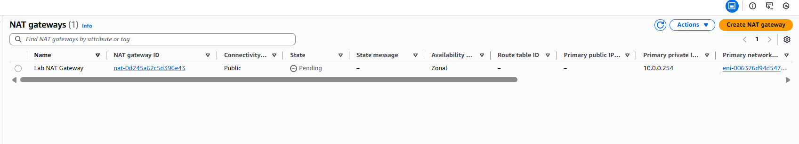

# Step 5 — Create NAT Gateway & Private Route Table

### NAT Gateway  
- Subnet: **Public Subnet**
- Elastic IP: **Allocate New**

### Private Route Table  
- Associate with: **Private Subnet**

Add route:

| Destination | Target |
|-------------|--------|
| 0.0.0.0/0   | NAT Gateway |

This enables outbound internet for private EC2.

