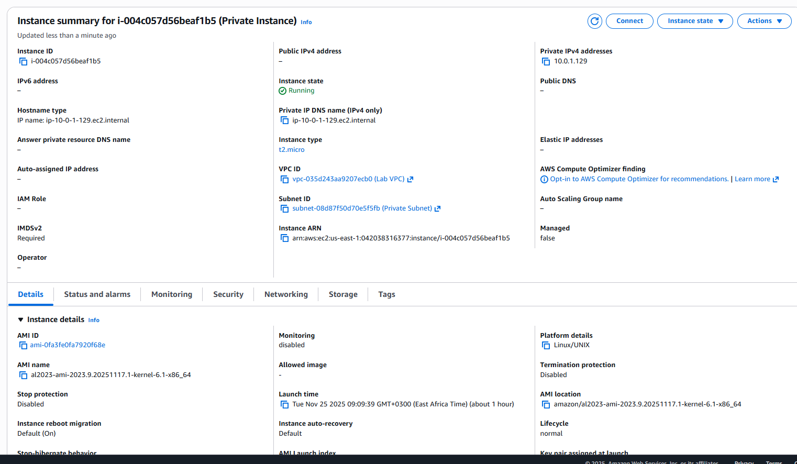

# Step 6 — Launch EC2 Instance in Private Subnet

### EC2 Settings  
- Name: **Private Instance**
- AMI: Amazon Linux 2023
- Type: t2.micro
- Key Pair: **vockey2**
- Subnet: **Private Subnet**

### Security Group: `Private Instance SG`  
| Type | Port | Source |
|------|------|--------|
| SSH  | 22   | Bastion Host SG |

