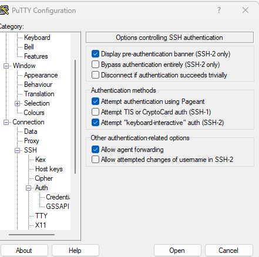

# Step 7 — Configure SSH Agent Forwarding

### macOS/Linux  

ssh-add -K vockey.pem
ssh-add -K vockey2.pem
ssh -A ec2-user@<bastion-ip>

### Windows (PuTTY + Pageant)  
- Load both keys in **Pageant**
- In PuTTY:
  - Connection → SSH → Auth → **Allow agent forwarding**

