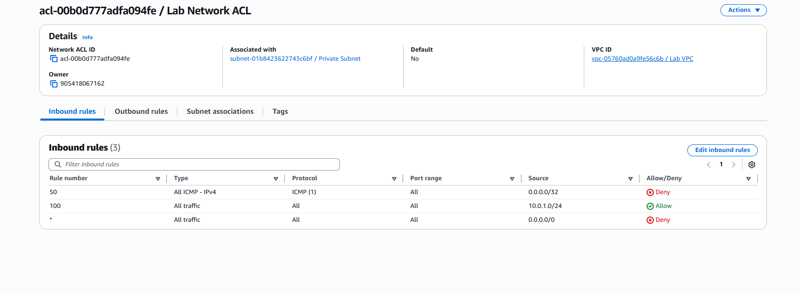

# Step 10 — Test Network ACL Blocking ICMP

### Create Test Instance  
- Subnet: Public Subnet  
- SG: Allow **All ICMP IPv4**

### From private instance:  
ping <test-instance-private-ip>

powershell
Copy code

Now add NACL rule:

| Rule | Type | Source | Action |
|------|-------|---------|--------|
| 100 | ICMP | <test-ip>/32 | DENY |

Ping should stop — ICMP blocked.

